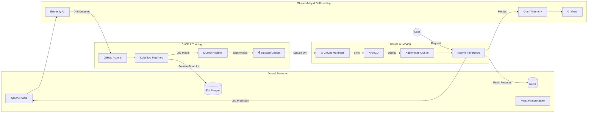

# 🚀 Automated Machine Learning Lifecycle Platform with GitOps and Cryptographic Model Verification

[](https://www.python.org/downloads/)
[](https://kubernetes.io/)
[](https://argoproj.github.io/cd/)
[](https://opensource.org/licenses/MIT)

> **A production-grade, closed-loop MLOps architecture designed to eliminate silent model degradation, resolve training-serving skew, and secure the ML supply chain against tampering.**

### 🏗️ System Architecture


---

## 📖 Overview

Traditional MLOps pipelines break down in production: models silently degrade due to data drift, training and serving environments diverge, and model artifacts lack cryptographic provenance. 

This project is a fully autonomous, enterprise-grade MLOps platform that solves these challenges. It continuously monitors live inference data, detects concept/data drift via **Evidently AI**, automatically triggers secure retraining pipelines, cryptographically signs the new model with **Sigstore/Cosign**, and promotes it to production via **GitOps (ArgoCD)** with automated canary rollbacks.

## 🌟 Core Capabilities

### 🔄 1. Closed-Loop "Self-Healing" Autonomy
No more paging data scientists at 2 AM. The system features an event-driven feedback loop:
1. Inference service pushes live predictions to **Apache Kafka**.
2. A dedicated drift monitor consumes the stream and calculates drift using **Evidently AI**.
3. If drift exceeds the threshold, it triggers a **GitHub Actions** webhook to automatically retrain the model.

### 🛡️ 2. Zero-Trust ML Supply Chain Security
Models are treated as critical software artifacts. Before any model is promoted to the GitOps repository, it is cryptographically signed using **Sigstore (Cosign)**. The inference service verifies this signature before loading the model into memory, ensuring zero-trust compliance and preventing model tampering.

### 🍽️ 3. Training-Serving Skew Elimination
Implemented **Feast** as a centralized Feature Store. Features are computed once and served consistently:
* **Offline Store (S3/Parquet):** Used for point-in-time correct historical joins during training (preventing data leakage).
* **Online Store (Redis):** Used for sub-millisecond feature retrieval during real-time inference.

### 🚢 4. GitOps-Driven Promotion & Safe Rollouts
Infrastructure and model deployments are fully declarative. 
* **GitOps:** **ArgoCD** continuously syncs the cluster state with a dedicated Git manifest repository. Model promotion is just a Git commit updating the `modelUri`.
* **Safe Rollouts:** New models are first deployed in **Shadow Mode** (comparing predictions without affecting users), then graduated to a **Canary Deployment** (5% -> 25% -> 100%). If business metrics drop, ArgoCD automatically rolls back.

---

## 🛠️ Technology Stack

| Category | Technologies Used |
| :--- | :--- |
| **Orchestration & CI/CD** | Kubernetes, GitHub Actions, ArgoCD (GitOps), Kustomize |
| **Data & Feature Store** | Apache Kafka, Feast (Redis Online / S3 Offline), PostgreSQL |
| **ML Training & Registry** | Kubeflow Pipelines, MLflow, Optuna (Hyperparameter Tuning) |
| **Model Serving** | KServe / Seldon Core, FastAPI (Custom wrapper) |
| **Observability & Drift** | Evidently AI, Prometheus, Grafana, OpenTelemetry |
| **Security & Governance** | Sigstore (Cosign), Open Policy Agent (OPA) |

---

## 🔄 The "Self-Healing" Lifecycle

Here is how the platform handles a real-world data drift event without human intervention:

```mermaid
sequenceDiagram
    participant User
    participant KServe as KServe (Inference)
    participant Kafka
    participant DriftMonitor as Drift Monitor (Evidently)
    participant GH as GitHub Actions (CI)
    participant Argo as ArgoCD (GitOps)
    
    User->>KServe: Request Prediction
    KServe->>Kafka: Async log prediction & features
    KServe-->>User: Return Prediction
    
    loop Every 5 Minutes
        Kafka->>DriftMonitor: Stream recent predictions
        DriftMonitor->>DriftMonitor: Calculate Data/Concept Drift
    end
    
    alt Drift > Threshold
        DriftMonitor->>GH: Trigger Retraining Webhook
        GH->>GH: Train, Evaluate & Sign Model (Cosign)
        GH->>Argo: Update GitOps Repo (New Model URI)
        Argo->>KServe: Sync & Deploy Canary
        KServe-->>User: Serve New Model
    end
